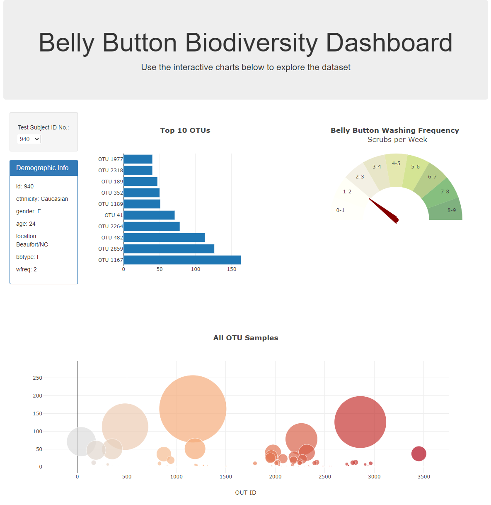

# Belly Button Bioiversity Dashboard

This project creates an interactive dashboard to explore the Belly Button Biodiversity dataset, which catalogs the microbes that colonize human navels.

The dataset reveals that a small handful of microbial species (also called operational taxonomic units, or OTUs, in the study) were present in more than 70% of people, while the rest were relatively rare.

## Features
The Dashboard features a series of charts describing the findings of operational taxonomic units (OTUs) found in an individual's belly button samples.

It includes: 

* a horizontal bar chart of the top ten OTUs

* a bubble chart showing the results of all samples

* a gauge chart showing how often the selected individual scrubbed their belly button per week

A summary of demographic data for the individual is also included.

## Using the Dashboard
Visit [eukestad.github.io/BellyButtonDashboard](https://eukestad.github.io/plotly-challenge/) to see the dashboard.

## About the Data
Hulcr, J. et al.(2012) A Jungle in There: Bacteria in Belly Buttons are Highly Diverse, but Predictable. Retrieved from: http://robdunnlab.com/projects/belly-button-biodiversity/results-and-data/

## Status
_finished_

## Inspiration
This project was assigned as part of the UTSA Data Analytics Bootcamp.

